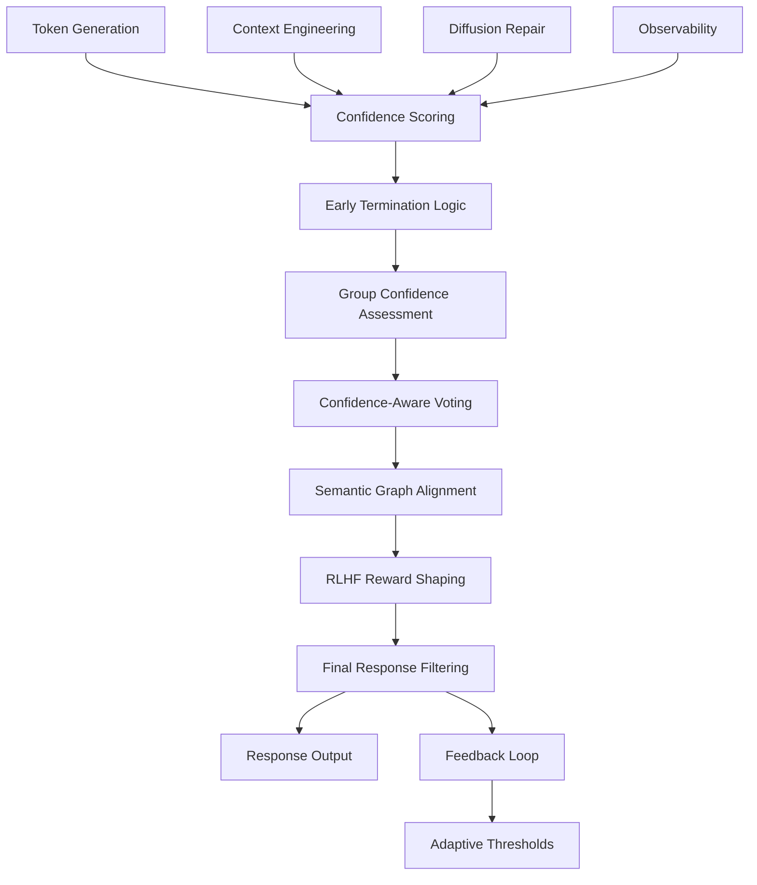

# Confidence Filtering Integration Guide

## Overview

This document provides a comprehensive guide to integrating confidence filtering with various components of the AI Research Agent system. The confidence filtering system uses DeepConf methodology to enhance response quality, reduce hallucinations, and improve system reliability through token-level confidence assessment, early termination, and confidence-aware decision making.

## Table of Contents

1. [Architecture Overview](#architecture-overview)
2. [Core Components](#core-components)
3. [Integration Points](#integration-points)
4. [Semantic Graph Integration](#semantic-graph-integration)
5. [RLHF Integration](#rlhf-integration)
6. [Context Engineering Integration](#context-engineering-integration)
7. [Diffusion Repair Integration](#diffusion-repair-integration)
8. [Cross-Module Synergies](#cross-module-synergies)
9. [Configuration Guide](#configuration-guide)
10. [Performance Metrics](#performance-metrics)
11. [Best Practices](#best-practices)
12. [Troubleshooting](#troubleshooting)

## Architecture Overview

The confidence filtering system is built on the DeepConf methodology and integrates with multiple system components:



## Core Components

### 1. ConfidenceScoringHook
**Purpose**: Real-time token-level confidence scoring during generation

**Key Features**:
- Token-level logprob-based confidence computation
- Real-time callback system for generation events
- Trace confidence aggregation

**Integration Points**:
```python
from extensions.stage_7_confidence_filtering import ConfidenceScoringHook

# Initialize with real-time scoring
scoring_hook = ConfidenceScoringHook(enable_real_time=True)

# Register callback for generation events
def confidence_callback(token_confidence):
    print(f"Token: {token_confidence.token}, Confidence: {token_confidence.confidence:.3f}")

scoring_hook.register_generation_callback(confidence_callback)
```

### 2. EarlyTerminationLogic
**Purpose**: Compute-efficient inference through confidence-based early stopping

**Key Features**:
- Offline warmup with 90th percentile threshold setting
- Adaptive threshold adjustment
- Token savings tracking

**Configuration**:
```python
early_termination = EarlyTerminationLogic(
    threshold_percentile=90,  # Use 90th percentile for threshold
    warmup_traces=16,         # Minimum traces for warmup
    window_size=10           # Sliding window size
)
```

### 3. ConfidenceAwareVoting
**Purpose**: Aggregate multiple reasoning paths with confidence weighting

**Key Features**:
- Top-N% trace filtering
- Confidence-weighted vote aggregation
- Semantic reliability boosting

**Usage**:
```python
voting_system = ConfidenceAwareVoting(
    top_n_percent=50,      # Keep top 50% confident traces
    min_confidence=0.1     # Minimum confidence threshold
)

# Filter and aggregate traces
top_traces = voting_system.filter_top_confident_traces(all_traces)
best_answer, confidence, metadata = voting_system.aggregate_votes(top_traces, answers)
```

### 4. SemanticGraphAlignment
**Purpose**: Integrate confidence with semantic graph for reasoning reliability

**Key Features**:
- Node reliability annotation
- Path confidence scoring
- Source prioritization based on reliability

## Integration Points

### Component Integration Matrix

| Component | Integration Type | Confidence Input | Confidence Output | Bidirectional |
|-----------|------------------|------------------|-------------------|---------------|
| Semantic Graph | Deep | Node reliability scores | Path confidence | ✅ |
| RLHF System | Deep | Reward shaping | Action confidence | ✅ |
| Context Engineering | Medium | Memory reliability | Context confidence | ✅ |
| Diffusion Repair | Medium | Repair confidence | Code quality scores | ✅ |
| Observability | Light | Event confidence | Performance metrics | ❌ |

## Semantic Graph Integration

### Overview
The semantic graph integration uses confidence metrics to annotate nodes with reasoning reliability and guide path selection during planning.

### Key Integration Points

#### 1. Node Reliability Annotation
```python
from extensions.stage_7_confidence_filtering import SemanticGraphAlignment

# Initialize semantic alignment
semantic_alignment = SemanticGraphAlignment(confidence_threshold=0.7)

# Annotate node with reasoning reliability
reliability_score = semantic_alignment.annotate_node_reliability(
    node_id="concept_node_123",
    trace_confidence=trace_confidence_object
)
```

#### 2. Path Selection Guidance
```python
# Guide path selection based on node reliability
candidate_paths = [
    ["node_1", "node_2", "node_3"],
    ["node_1", "node_4", "node_5"],
    ["node_1", "node_6", "node_7"]
]

scored_paths = semantic_alignment.guide_path_selection(candidate_paths)
# Returns: [(path, confidence_score), ...] sorted by confidence
```

#### 3. Source Prioritization
```python
# Prioritize retrieval sources based on reliability
sources = [
    {"id": "academic_paper_1", "source_type": "academic", "citation_count": 150},
    {"id": "blog_post_1", "source_type": "blog", "recency_score": 0.9},
    {"id": "official_docs_1", "source_type": "official_docs", "authority": 0.95}
]

prioritized_sources = semantic_alignment.prioritize_retrieval_sources(sources)
```

### Configuration
```json
{
  "semantic_graph_confidence": {
    "confidence_threshold": 0.7,
    "reliability_decay_rate": 0.1,
    "path_confidence_method": "geometric_mean",
    "source_reliability_weights": {
      "academic": 0.9,
      "official_docs": 0.85,
      "blog": 0.6,
      "forum": 0.4
    }
  }
}
```

### Benefits
- **Improved Reasoning**: High-confidence paths preferred during planning
- **Source Quality**: Reliable sources prioritized for retrieval
- **Knowledge Validation**: Low-confidence nodes flagged for review
- **Adaptive Learning**: Node reliability updated based on outcomes

## RLHF Integration

### Overview
The RLHF integration shapes rewards based on confidence metrics, implements confidence-aware exploration, and calibrates model responses.

### Key Integration Points

#### 1. Confidence-Aware Reward Shaping
```python
from extensions.stage_5_rlhf_agentic_rl import ConfidenceAwareRewardShaping

# Initialize reward shaping
reward_shaper = ConfidenceAwareRewardShaping(
    confidence_weight=0.3,      # Weight for confidence bonus
    uncertainty_penalty=0.2     # Penalty for high uncertainty
)

# Shape reward based on confidence
confidence_metrics = {
    "confidence_score": 0.8,
    "uncertainty_score": 0.2,
    "mean_logprob": -0.5,
    "variance": 0.1
}

shaping_result = reward_shaper.shape_reward_with_confidence(
    base_reward=0.7,
    confidence_metrics=confidence_metrics
)
```

#### 2. Dynamic Exploration Strategy
```python
# Confidence-aware action selection
state = {"query": "How do neural networks work?", "context_size": 1000}
available_actions = ["detailed_explanation", "simple_overview", "step_by_step"]

# Higher uncertainty leads to more exploration
selected_action, metadata = agentic_rl.select_action(state, available_actions)
# metadata includes: predicted_reward, confidence_score, exploration_rate
```

#### 3. Calibration-Aware Alignment
```python
# Evaluate alignment with confidence calibration
response = "Neural networks learn through backpropagation..."
context = {
    "query": "How do neural networks learn?",
    "confidence_metrics": {
        "confidence_score": 0.9,
        "uncertainty_score": 0.1
    }
}

alignment_scores = alignment_system.evaluate_alignment(response, context)
# Includes calibration adjustments for honesty and accuracy
```

### Reward Shaping Formula
```
shaped_reward = base_reward + 
                confidence_bonus - 
                uncertainty_penalty + 
                consistency_bonus + 
                calibration_adjustment

Where:
- confidence_bonus = confidence_weight × confidence_score
- uncertainty_penalty = uncertainty_penalty × uncertainty_score  
- consistency_bonus = 0.1 × max(0, 1.0 - variance)
- calibration_adjustment = f(confidence_score, base_reward)
```

### Configuration
```json
{
  "rlhf_confidence": {
    "confidence_weight": 0.3,
    "uncertainty_penalty": 0.2,
    "calibration_threshold": 0.3,
    "overconfidence_penalty": -0.2,
    "well_calibrated_bonus": 0.1,
    "exploration_confidence_factor": 1.0
  }
}
```

### Benefits
- **Better Calibration**: Overconfident wrong answers penalized
- **Adaptive Exploration**: More exploration when uncertain
- **Quality Filtering**: High-confidence traces preferred for training
- **Honest Responses**: Appropriate uncertainty expression rewarded

## Context Engineering Integration

### Overview
Context engineering integration uses confidence to assess memory reliability, pack context adaptively, and manage memory tiers based on confidence scores.

### Key Integration Points

#### 1. Memory Reliability Assessment
```python
from extensions.stage_2_context_builder import MemoryTierManager

# Store memory with confidence-based reliability
memory_id = memory_manager.store_memory(
    content="Machine learning uses statistical methods...",
    memory_tier=MemoryTier.LONG_TERM,
    relevance_score=0.8,
    metadata={
        "confidence_score": 0.9,
        "source_reliability": 0.85,
        "validation_status": "verified"
    }
)
```

#### 2. Confidence-Aware Context Packing
```python
from extensions.stage_2_context_builder import AdaptiveContextPacker

# Pack context with confidence weighting
packer = AdaptiveContextPacker(max_context_tokens=2000)

# Memories with higher confidence get priority
packed_result = packer.pack_context(
    memory_items=retrieved_memories,
    task_type=TaskType.RESEARCH,
    strategy=ContextPackingStrategy.CONFIDENCE_WEIGHTED
)
```

#### 3. Memory Tier Promotion
```python
# Promote memories based on confidence and usage
high_confidence_memories = [
    m for m in memories 
    if m.metadata.get("confidence_score", 0) > 0.8
]

for memory in high_confidence_memories:
    if memory.access_count > 5:  # Frequently accessed + high confidence
        memory_manager.promote_memory(memory.id, MemoryTier.LONG_TERM)
```

### Configuration
```json
{
  "context_confidence": {
    "confidence_threshold": 0.7,
    "memory_promotion_threshold": 0.8,
    "context_packing_strategy": "confidence_weighted",
    "reliability_decay_rate": 0.05,
    "tier_confidence_weights": {
      "short_term": 0.3,
      "long_term": 0.5,
      "episodic": 0.2
    }
  }
}
```

### Benefits
- **Quality Context**: High-confidence memories prioritized
- **Adaptive Packing**: Context packed based on confidence and relevance
- **Memory Management**: Reliable memories promoted to long-term storage
- **Noise Reduction**: Low-confidence memories filtered out

## Diffusion Repair Integration

### Overview
Diffusion repair integration uses confidence metrics to assess code repair quality, guide repair strategies, and validate repair outcomes.

### Key Integration Points

#### 1. Repair Confidence Assessment
```python
from extensions.stage_4_diffusion_repair import RuntimeRepairOperator

# Repair code with confidence tracking
repair_operator = RuntimeRepairOperator()

broken_code = """
def hello_world(
    print("Hello, World!")
"""

repair_result = repair_operator.repair_code(
    broken_code=broken_code,
    language=LanguageType.PYTHON,
    error_type="SyntaxError"
)

# Access repair confidence
repair_confidence = repair_result.confidence_score
repair_provenance = repair_result.provenance
```

#### 2. Confidence-Guided Repair Strategy
```python
# Select repair strategy based on confidence
if repair_confidence > 0.8:
    strategy = RepairStrategy.CONSERVATIVE  # High confidence, minimal changes
elif repair_confidence > 0.5:
    strategy = RepairStrategy.MODERATE     # Medium confidence, balanced approach
else:
    strategy = RepairStrategy.AGGRESSIVE   # Low confidence, try multiple approaches
```

#### 3. Repair Validation
```python
# Validate repair using confidence metrics
def validate_repair(original_code, repaired_code, confidence_metrics):
    if confidence_metrics["confidence_score"] < 0.6:
        return False, "Low repair confidence"
    
    if confidence_metrics["semantic_similarity"] < 0.7:
        return False, "Semantic drift detected"
    
    return True, "Repair validated"
```

### Configuration
```json
{
  "diffusion_repair_confidence": {
    "min_repair_confidence": 0.6,
    "semantic_similarity_threshold": 0.7,
    "strategy_confidence_thresholds": {
      "conservative": 0.8,
      "moderate": 0.5,
      "aggressive": 0.0
    },
    "validation_enabled": true
  }
}
```

### Benefits
- **Quality Repairs**: High-confidence repairs preferred
- **Strategy Selection**: Repair approach adapted to confidence level
- **Validation**: Low-confidence repairs flagged for review
- **Provenance Tracking**: Repair confidence tracked for analysis

## Cross-Module Synergies

### Overview
Cross-module synergies leverage confidence information across multiple components to create emergent behaviors and improved system performance.

### Key Synergies

#### 1. Confidence Cascade
```python
# Confidence flows through the system
semantic_confidence = semantic_graph.get_path_confidence(reasoning_path)
context_confidence = context_manager.get_context_reliability(context)
repair_confidence = diffusion_repair.get_repair_confidence(code_fix)

# Aggregate confidence for final decision
aggregate_confidence = (
    0.4 * semantic_confidence +
    0.3 * context_confidence +
    0.3 * repair_confidence
)
```

#### 2. Adaptive Thresholds
```python
# Thresholds adapt based on cross-module performance
class AdaptiveThresholdManager:
    def update_thresholds(self, performance_metrics):
        if performance_metrics["accuracy"] < 0.8:
            # Lower thresholds to be more conservative
            self.confidence_threshold *= 0.95
            self.uncertainty_penalty *= 1.05
        elif performance_metrics["accuracy"] > 0.9:
            # Raise thresholds to be more aggressive
            self.confidence_threshold *= 1.02
            self.uncertainty_penalty *= 0.98
```

#### 3. Confidence-Based Routing
```python
# Route requests based on confidence requirements
def route_request(request, confidence_requirements):
    if confidence_requirements["accuracy"] > 0.9:
        # High accuracy required - use semantic graph + RLHF
        return ["semantic_graph", "rlhf_system"]
    elif confidence_requirements["speed"] > 0.8:
        # Speed required - use context engineering only
        return ["context_engineering"]
    else:
        # Balanced approach - use all components
        return ["semantic_graph", "context_engineering", "rlhf_system"]
```

### Synergy Configuration
```json
{
  "cross_module_synergies": {
    "confidence_cascade_weights": {
      "semantic_graph": 0.4,
      "context_engineering": 0.3,
      "diffusion_repair": 0.3
    },
    "adaptive_thresholds": {
      "enabled": true,
      "adaptation_rate": 0.05,
      "performance_window": 100
    },
    "confidence_routing": {
      "enabled": true,
      "routing_thresholds": {
        "high_accuracy": 0.9,
        "high_speed": 0.8,
        "balanced": 0.7
      }
    }
  }
}
```

## Configuration Guide

### Complete Configuration Example
```json
{
  "confidence_filtering": {
    "strategy": "adaptive_threshold",
    "threshold": 15.0,
    "adaptation_rate": 0.1,
    "enable_real_time": true,
    "top_n_percent": 30,
    "semantic_threshold": 0.7,
    
    "early_termination": {
      "threshold_percentile": 90,
      "warmup_traces": 16,
      "window_size": 10
    },
    
    "voting_system": {
      "top_n_percent": 50,
      "min_confidence": 0.1,
      "semantic_boost": 1.2
    },
    
    "reward_shaping": {
      "confidence_weight": 0.3,
      "uncertainty_penalty": 0.2,
      "calibration_threshold": 0.3
    },
    
    "validation": {
      "validation_threshold": 0.8,
      "min_samples": 100,
      "offline_evaluation": true
    }
  }
}
```

### Environment Variables
```bash
# Confidence filtering settings
export CONFIDENCE_THRESHOLD=15.0
export CONFIDENCE_ADAPTATION_RATE=0.1
export CONFIDENCE_REAL_TIME=true

# Integration settings
export SEMANTIC_CONFIDENCE_THRESHOLD=0.7
export RLHF_CONFIDENCE_WEIGHT=0.3
export CONTEXT_CONFIDENCE_ENABLED=true
```

## Performance Metrics

### Key Metrics to Monitor

#### 1. Confidence Calibration
```python
def compute_calibration_metrics(predictions, confidences, ground_truth):
    """Compute confidence calibration metrics"""
    
    # Expected Calibration Error (ECE)
    ece = expected_calibration_error(predictions, confidences, ground_truth)
    
    # Reliability Diagram
    reliability_diagram = compute_reliability_diagram(predictions, confidences, ground_truth)
    
    # Brier Score
    brier_score = compute_brier_score(predictions, confidences, ground_truth)
    
    return {
        "ece": ece,
        "reliability_diagram": reliability_diagram,
        "brier_score": brier_score
    }
```

#### 2. System Performance
```python
performance_metrics = {
    "accuracy": 0.92,
    "precision": 0.89,
    "recall": 0.94,
    "f1_score": 0.91,
    "confidence_correlation": 0.78,
    "early_termination_rate": 0.15,
    "token_savings": 0.23,
    "calibration_error": 0.08
}
```

#### 3. Integration Effectiveness
```python
integration_metrics = {
    "semantic_graph_reliability": 0.85,
    "rlhf_reward_improvement": 0.12,
    "context_quality_boost": 0.18,
    "repair_success_rate": 0.87,
    "cross_module_synergy_score": 0.76
}
```

### Monitoring Dashboard
```python
def create_confidence_dashboard():
    """Create monitoring dashboard for confidence filtering"""
    
    dashboard = {
        "system_health": {
            "confidence_distribution": get_confidence_distribution(),
            "calibration_curve": get_calibration_curve(),
            "performance_trends": get_performance_trends()
        },
        
        "integration_status": {
            "semantic_graph": get_semantic_integration_status(),
            "rlhf_system": get_rlhf_integration_status(),
            "context_engineering": get_context_integration_status(),
            "diffusion_repair": get_repair_integration_status()
        },
        
        "alerts": {
            "low_calibration": check_calibration_alerts(),
            "performance_degradation": check_performance_alerts(),
            "integration_failures": check_integration_alerts()
        }
    }
    
    return dashboard
```

## Best Practices

### 1. Threshold Management
- **Start Conservative**: Begin with higher confidence thresholds and gradually lower them
- **Monitor Calibration**: Regularly check if confidence scores match actual performance
- **Adaptive Adjustment**: Use performance feedback to automatically adjust thresholds

### 2. Integration Strategy
- **Gradual Rollout**: Integrate one component at a time to isolate issues
- **A/B Testing**: Compare confidence-enabled vs disabled performance
- **Fallback Mechanisms**: Always have non-confidence-based fallbacks

### 3. Performance Optimization
- **Batch Processing**: Process confidence computations in batches when possible
- **Caching**: Cache confidence scores for frequently accessed items
- **Early Termination**: Use early termination to save computational resources

### 4. Quality Assurance
- **Regular Validation**: Run offline validation with ground truth data
- **Human Review**: Have humans review low-confidence decisions
- **Continuous Monitoring**: Monitor confidence-performance correlation

## Troubleshooting

### Common Issues and Solutions

#### 1. Poor Calibration
**Symptoms**: Confidence scores don't match actual performance
**Solutions**:
- Increase validation dataset size
- Adjust calibration parameters
- Use temperature scaling for better calibration

#### 2. Over-Conservative Filtering
**Symptoms**: Too many responses filtered, low recall
**Solutions**:
- Lower confidence thresholds
- Adjust uncertainty penalties
- Review calibration settings

#### 3. Integration Failures
**Symptoms**: Components not receiving confidence information
**Solutions**:
- Check configuration files
- Verify import statements
- Test individual integrations

#### 4. Performance Degradation
**Symptoms**: System slower after confidence integration
**Solutions**:
- Enable batch processing
- Use confidence caching
- Optimize threshold computations

### Debug Commands
```bash
# Test confidence filtering
python -m extensions.stage_7_confidence_filtering --test

# Validate integration
python -m extensions.tests.test_confidence_filtering --integration

# Check configuration
python -c "from extensions.stage_7_confidence_filtering import integrate_confidence_filtering; print(integrate_confidence_filtering().get_statistics())"

# Monitor performance
python -m extensions.benchmarks.performance_benchmark --confidence-filtering
```

### Logging Configuration
```python
import logging

# Configure confidence filtering logging
logging.getLogger('confidence_filtering').setLevel(logging.INFO)
logging.getLogger('confidence_integration').setLevel(logging.DEBUG)

# Log confidence decisions
logger = logging.getLogger('confidence_filtering')
logger.info(f"Confidence score: {confidence_score:.3f}, Decision: {decision}")
```

## Conclusion

The confidence filtering integration provides a robust framework for improving AI Research Agent reliability through:

- **Multi-level Confidence Assessment**: From token-level to system-level confidence
- **Cross-Component Integration**: Seamless integration with all major system components
- **Adaptive Behavior**: Dynamic thresholds and strategies based on performance
- **Quality Assurance**: Comprehensive validation and monitoring capabilities

By following this integration guide, you can successfully implement confidence filtering across your AI Research Agent system, leading to more reliable, calibrated, and effective AI responses.

For additional support, refer to the API documentation, run the provided test suites, and monitor the system performance metrics regularly.